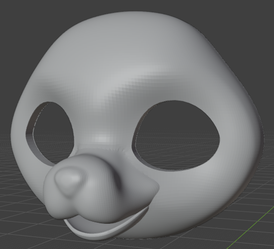
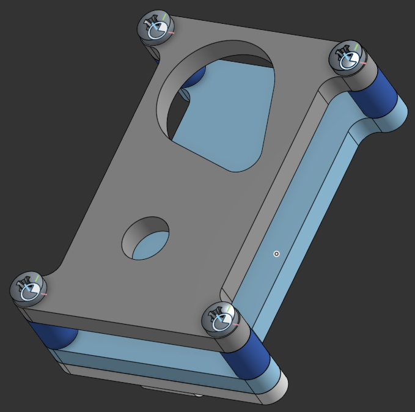

# Feline fursuit head with a night vision setup.

A fursuit head using a custom 3d printed headbase, equipped with a night vision camera feeding into a Raspberry Pi.

### Headbase ([Blender file here](cad/headbase/headbase.blend)):

> **This headbase was designed in blender entirely from scratch. Feel free to distribute it, sell prints of it, modify it, and use it in your own designs. Please do not sell the model, or any variations of it, furry culture should not be only for those who can afford it (selling 3d prints is fine).**

### Camera Case for RPi camera with IR filter removed and one IR lamp ([OnShape link here](https://cad.onshape.com/documents/7e6dfef074ee86c4a3a09359/w/cf8858eff46eb8a1bd0e9c59/e/8365d0a65fd6d4f18491fff8?renderMode=0&uiState=6a20f848672360de2aa17971)):
