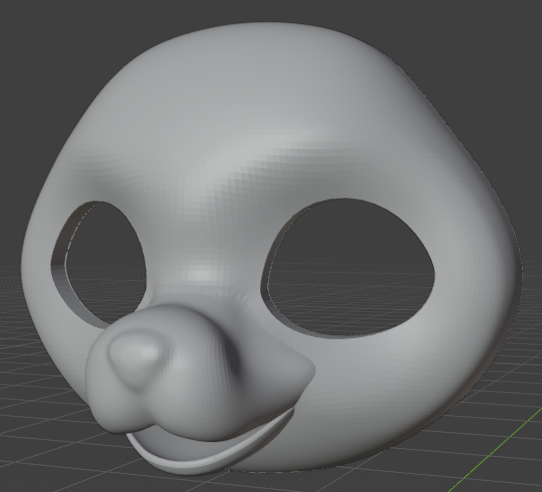
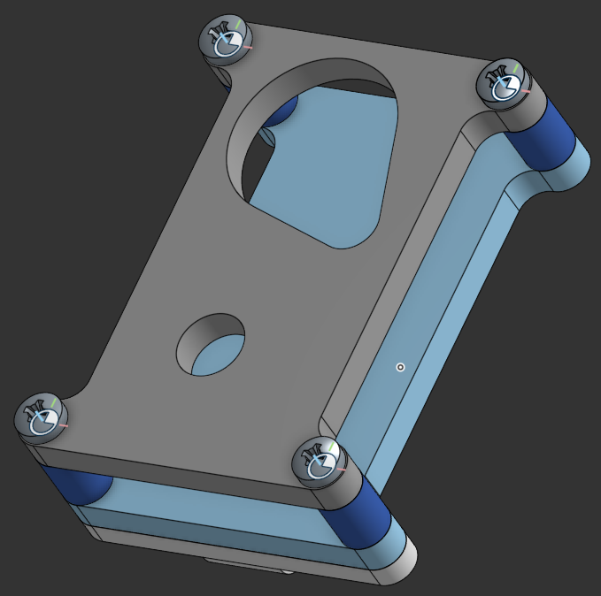

# Feline fursuit head with a night vision setup.

A fursuit head using a custom 3d printed headbase, equipped with a night vision camera feeding into a Raspberry Pi. I'm currently planning to view the camera feed from my phone, but I may opt to work in a small color display.

### Headbase ([Blender file here](cad/headbase/headbase.blend)):

> **This headbase was designed in blender entirely from scratch. Feel free to distribute it, sell prints of it, modify it, and use it in your own designs. Please do not sell the model, or any variations of it, furry culture should not be only for those who can afford it (selling 3d prints is fine).**
> ## There's no STEP file! I'm gonna fine Macondo!
> Please don't. STEP is a CAD format, based on geometry, while Blender is a mesh-based modeling program. STL is the correct format for exporting, and I've provided STLs in the `cad/headbase` folder. See https://blender.stackexchange.com/questions/314140/how-to-export-step-files-from-blender if you don't believe me.


### Camera Case for RPi camera with IR filter removed and one IR lamp ([OnShape link here](https://cad.onshape.com/documents/7e6dfef074ee86c4a3a09359/w/cf8858eff46eb8a1bd0e9c59/e/8365d0a65fd6d4f18491fff8?renderMode=0&uiState=6a20f848672360de2aa17971)):


## I want to build this for myself!
### Parts: 

> **Prices below are what it cost me, the parts I already had are priced $0.**

| Item                                                 | Price Each | Quantity |
|------------------------------------------------------|------------|----------|
| Fur                                                  | 101        | 1        |
| Raspberry Pi Night Vision Camera                     | 0          | 1        |
| Raspberry Pi Zero                                    | 0          | 1        |
| Raspberry Pi Zero Camera Adapter and Cable Extension | 0          | 1        |
| Waveshare UPS HAT                                    | 0          | 1        |

### Wiring Diagram:

```
WS UPS HAT <==40-pin Header==> Raspberry Pi <==Ribbon Cable==> Camera Cable Extender <==Ribbon Cable==> Night Vision Pi Camera
```

### Instructions:

- Do research, watch tutorials, know what you're getting into.
- 3d print the headbase, you can find a tutorial for prepping it here: https://www.fursuitmak.ing/tutorials/headbaseprep.php
- Fur the headbase: https://www.fursuitmak.ing/tutorials/furring.php.
- Remove one IR lamp from the camera. Put it in the case, and connect the camera to the Pi Zero. Put the UPS hat on the Pi Zero.
- Clip the camera case to the bottom of the fur on the neck, find a place inside the headbase to secure the Pi.
